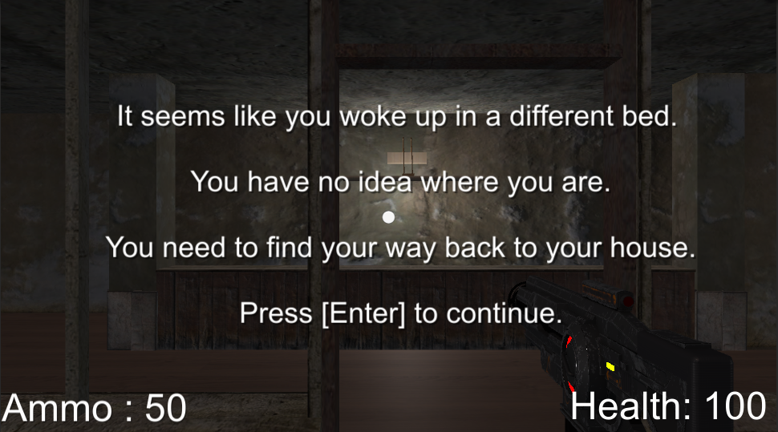
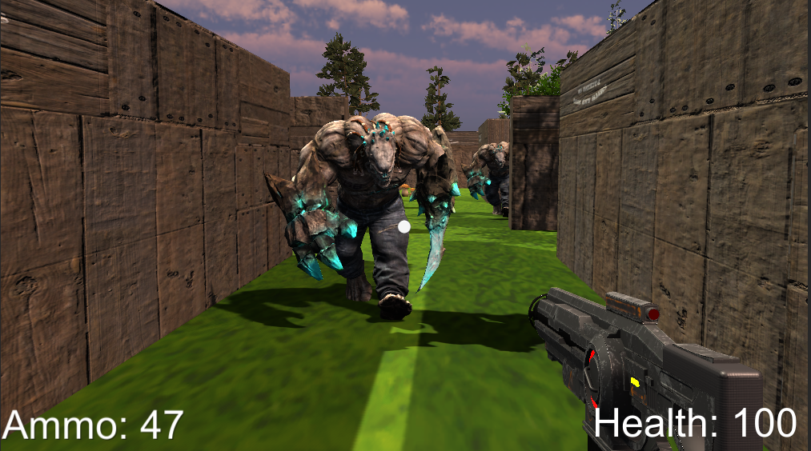
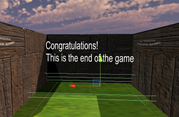
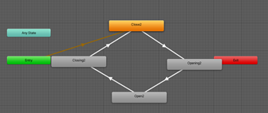

## General information

I created a basic, functional game level in Unity from scratch which is a first person shooter game. The prefabs of the AI are downloaded from mixamo.com as well as their animations. The story of the game is explained at start of game and the game will not start unless you press enter:

It seems like you woke up in a different bed. You have no idea where you are. You need to find your way back to your house. Press [Enter] to continue.

For the design of the maze I assembled cubes in different shapes to my own liking and this wonderful and interesting map was created. All the assets are downloaded from the “Asset Store”, including the house you start in. In the middle of the maze there is a safe place where the player cannot be attacked by the AI who are constantly trying to kill him. The doors from the safe zone can only be opened by the player, once he is close enough to them and they also close as soon as he gets further away.

## Gameplay



## Enemies

There are three enemies in total. The Mutant, who is the first AI the player comes across, has a spawn rate of 10 seconds. He spawns at the beginning of the game, so as a result the player will be entertained throughout the entirety of the game. Secondly comes the Maw with a spawn rate of 20 seconds followed by the Warrok, whose spawn rate is 30 seconds. I added animations for Running, Swiping,  Idle and Death. Each of them growls when they die, but not after giving up without a good fight.

## Scenes

I implemented scenes for both the Main Menu and the Settings. In the main menu I wanted the player to see a message that can attract him into playing the game.

## Game Ending

The game ends when the player reaches the end of the maze. When the player steps on the collider box, he will be sent to the Main_Menu Scene from where he can either restart the game or quit. It does not matter if all the enemies are still alive as long as the player escapes. 

## Doors Opening

For the doors situated in the middle of the maze I used both an animator and lines of code. I learned how to do this from a course in Udemy and I really wanted to make use of almost all the knowledge I have and so I did.

