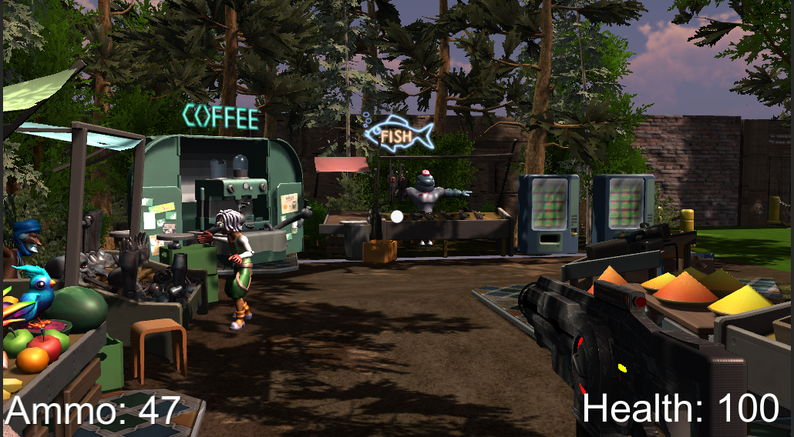
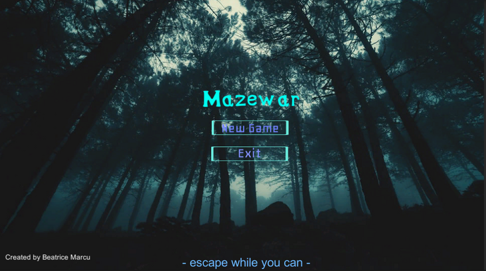
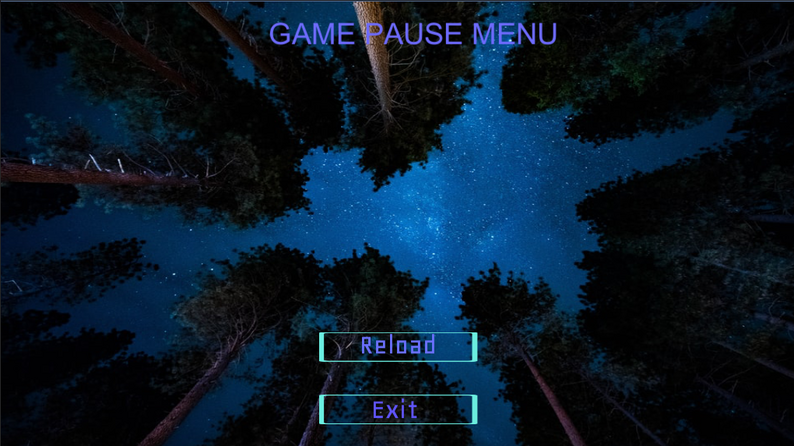
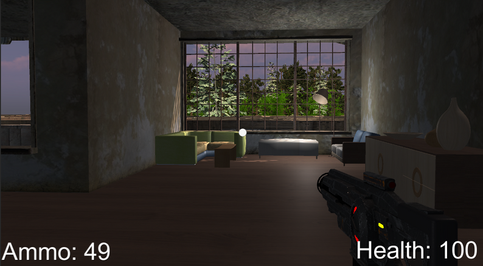
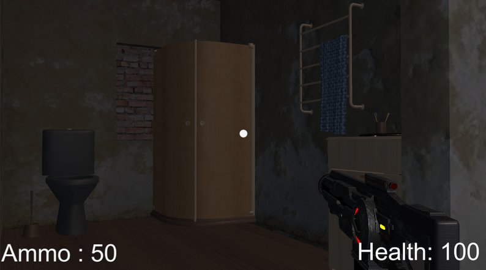
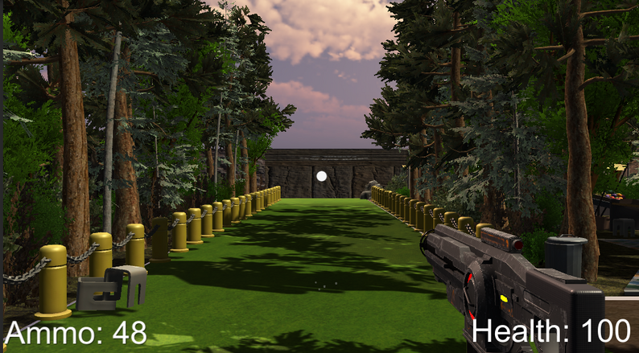

### 🎓 Development Notes
This project was created independently after completing Udemy courses on Unity development. It represents an early exploration of Unity, where I applied foundational knowledge to build complete gameplay systems including enemy AI, spawn management, and environmental interaction. The project provided hands-on experience with animation systems, collision detection, and scene flow management—taking concepts from tutorials and implementing them in an original game design.



## 🎮 Project Overview
Maze War is a first-person shooter built in Unity where survival depends on strategic navigation and combat. Players wake up in an unfamiliar location and must fight their way through a maze filled with hostile creatures to escape back home. The story of the game is explained at the start, and the game will not start unless you press enter:

The maze design features custom-assembled cube structures arranged to create an intricate level. In the middle of the maze there is a safe zone where the player cannot be attacked by enemies. The doors from the safe zone can only be opened by the player once they are close enough, and they automatically close as soon as the player moves away.

**Tech Stack:** Unity, C#, Mixamo (character models and animations)

### Key Features:

- Dynamic enemy spawning system with staggered spawn rates
- Proximity-based automatic door mechanics
- Three unique enemy types with custom AI behaviors
- Safe zone system providing strategic respite points

## 💫 Gameplay Systems
#### Enemy AI & Spawn Management
Three enemy types hunt the player throughout the maze, each with distinct spawn timings:

- The Mutant - Spawns every 10 seconds from game start, ensuring constant pressure
- The Maw - Appears every 20 seconds, increasing difficulty
- The Warrok - Spawns every 30 seconds as the most formidable threat

Each enemy features fully animated states including Running, Swiping, Idle, and Death sequences with audio feedback.

### Safe Zone Design
The maze's center features a protected area where enemies cannot enter. Doors automatically open when the player approaches and close behind them, creating strategic decision points about when to retreat versus push forward.

### Victory Condition
Players win by reaching the maze exit trigger, regardless of remaining enemies. This design encourages risk-reward decisions between fighting and fleeing.

## 🔧 Technical Implementation
### Door Automation System
Implemented proximity-based door controls using Unity's Animator component combined with custom collision detection scripts. Doors respond dynamically to player distance, creating seamless environmental interaction.

### Scene Management
Built a complete menu flow including:

- Main Menu with narrative hook
- Settings configuration
- Game-over transitions back to main menu

## 📸 Gallery

