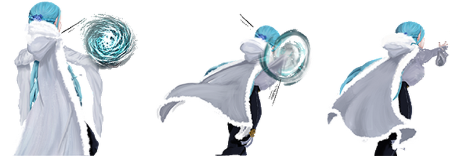

### 🎓 Development Notes
Ice Land was created as an intake assignment for Breda University of Applied Science, Creative Media and Game Technologies, Programming program using a provided [template](https://www.3dgep.com/cpp-fast-track-2-template/). This project provided hands-on experience with C++ game development fundamentals, including state management, collision detection, turn-based combat logic, and working within an existing codebase framework, demonstrating the ability to build complete gameplay systems using object-oriented programming principles.



## 🎮 Project Overview

Ice Land is a single-player 2D RPG where the main character is Elsa, the ice princess, who must fight monsters to escape through an igloo.

The main menu contains two buttons which can be selected using the right or left arrows: Play or Quit, and then activated by pressing Enter.

**Tech Stack:** C++, provided game template

### Key Features:

- Turn-based battle system with multiple enemy types
- Map exploration with collision detection on snowy paths
- Item and power-up inventory system
- State machine managing transitions between menu, map, and battle screens

## 💫 Gameplay Systems

### Map Exploration
On the map screen, the player can only walk on the snowy path where chests containing power-ups can be found. When the player encounters an enemy, the game transitions to the battle screen.

### Battle System
During battle, the player can use items and power-ups collected throughout the map:

- Life Regen - Restores health
- Attack Boost - Increases damage output
- Defense Boost - Reduces incoming damage
- Bomb - High-damage attack item

All monsters must be defeated before the player can escape.

### Victory Condition
Players must defeat all enemies encountered on the map and reach the igloo to escape and win the game.

## 🔧 Technical Implementation
The game uses a state machine architecture implemented in game.cpp that loads and manages different game screens. The starting game state is the MainMenu, which updates and draws the MapScreen when the Play button is pressed.
When the player's position matches an enemy's position on the map, the game transitions to the BattleScreen. After the battle concludes, the game returns to the MapScreen, preserving the player's progress.
This architecture cleanly separates concerns and allows for smooth transitions between different gameplay modes.

## Controls

- WASD - Move the player around
- ENTER - Skip text boxes and attack during battle
- Arrow Keys - Navigate menu options

## 📸 Gallery

