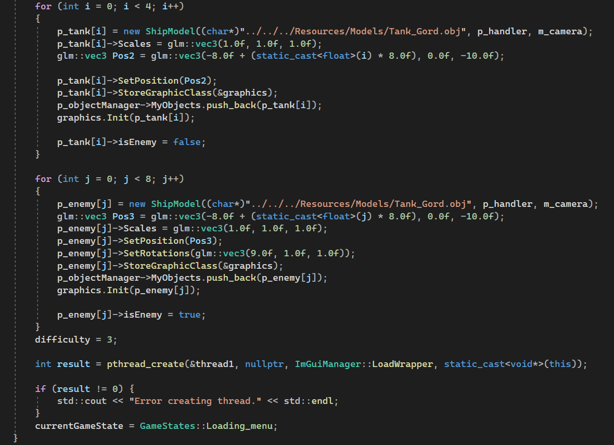
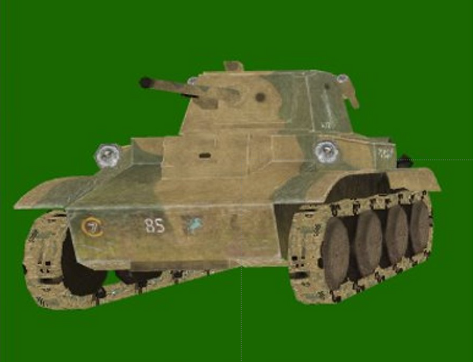

## General information

RTS3D is a student project where I created a 3D tank game from scratch in Raspberry Pi, a linux machine,  with no other knowledge prior than C++.

## Gameplay



I started with an [OpenGL tutorial](https://learnopengl.com/Getting-started/OpenGL)  which helped me understand the basics of what I will have to work with.  I also used ImGui which allowed me to create menu’s. It was quite easy to set up and to get the handle of it. On the other hand, BulletPhysics was a little tricky.  I found a manual on [github](https://github.com/bulletphysics/bullet3/tree/master/docs)  which helped me a lot. In order to test that the physics were linked to the objects, I had to create a new class called PhysicsDraw. I also used rays to be able to select the tanks. First I calculated the camera position, a temporary vector which was the ray from the mouse and then the vector where the ray hits on screen.

Even though we were giving a template to work on, I decided to create my own. I chose the things that I knew I would be using and then added libraries or other classes.

One of the menu’s is a Loading Screen which loads each object from the scene. I did this using threads.

The map of the game has procedurally generated textures, which means that at the top of the mountains there is a snow texture, and at the bottom a grass texture.

The tanks get assigned random names when they are selected. They can also be unselected by pressing left click anyone in the map, which makes them stop moving.

There are 3 different levels with different difficulties. In the first one, the player has to kill 4 enemies, in the second one 6 enemies and in the last one, 8 enemies.

For now, the game ends when the player is in a close range to the enemies.

