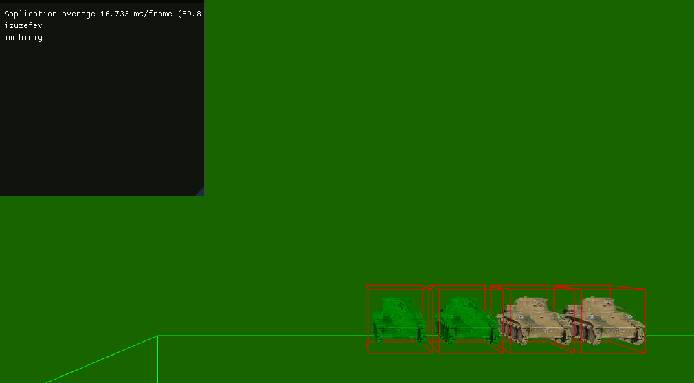
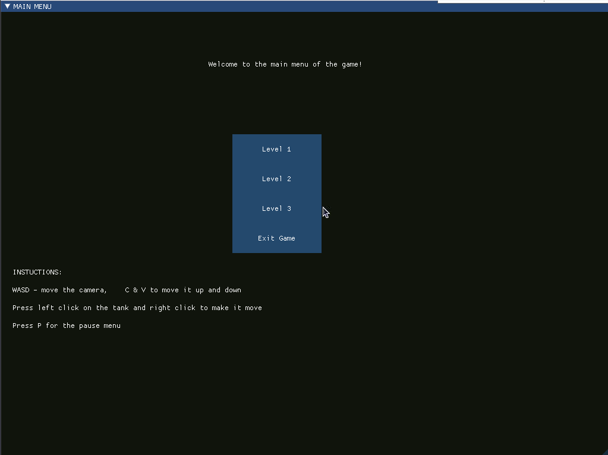
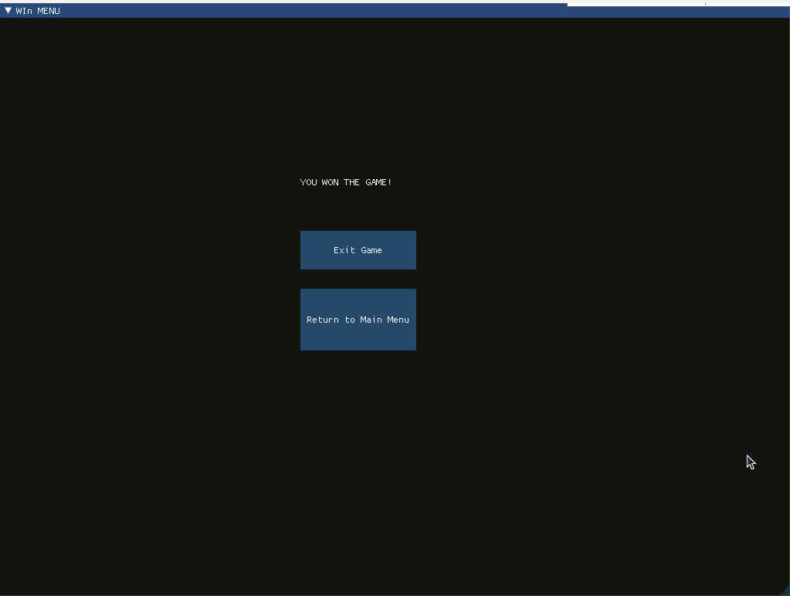
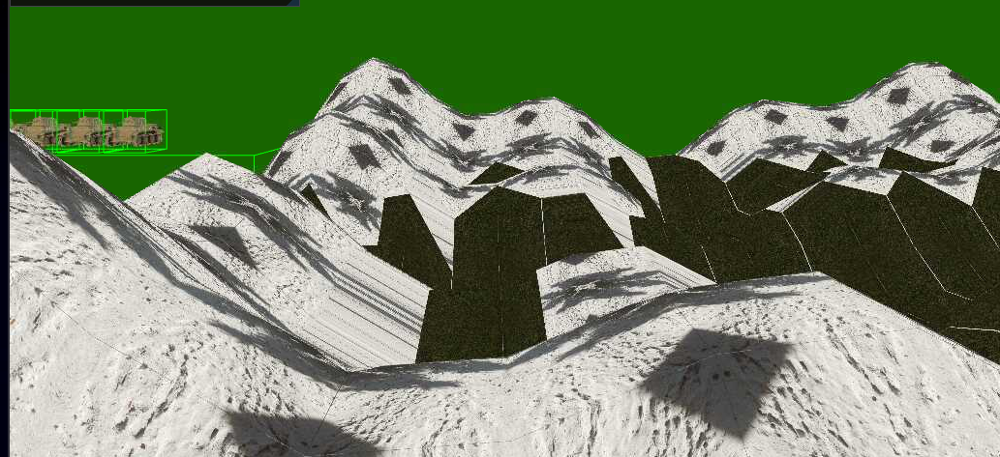

## 🎓 Development Notes
RTS3D is a student project where I created a 3D tank game from scratch on a Raspberry Pi (Linux) using only C++ knowledge, with no prior graphics programming experience. This project involved learning OpenGL, implementing physics simulation with Bullet Physics, and building a complete game engine architecture independently. The project demonstrates self-directed learning and the ability to integrate multiple complex systems into a functional game.



## 🎮 Project Overview
RTS3D is a 3D real-time strategy game where players command tanks to defeat waves of enemies across three difficulty levels. The game features procedurally generated terrain, physics-based gameplay, and a custom-built engine running on Raspberry Pi hardware.

**Tech Stack:** C++, OpenGL, Bullet Physics, ImGui, Raspberry Pi (Linux)

### Key Features:

- Custom 3D game engine built from scratch
- Bullet Physics integration for realistic tank movement and collisions
- Ray-casting system for tank selection
- Procedurally generated terrain textures based on elevation
- Multi-threaded loading screen for scene optimization
- Three difficulty levels with increasing enemy counts

## 💫 Gameplay Systems
**Tank Selection & Control**

Tanks can be selected using a ray-casting system that calculates the camera position, creates a ray from the mouse cursor, and determines where the ray intersects with objects in the scene. Selected tanks are assigned random names and can be deselected by left-clicking anywhere on the map, causing them to stop moving.

### Level Progression
The game features three levels with escalating difficulty:

- Level 1: Defeat 4 enemy tanks
- Level 2: Defeat 6 enemy tanks
- Level 3: Defeat 8 enemy tanks

Currently, combat is resolved through proximity—the game ends when the player gets within close range of enemies.

### Procedural Terrain
The game map uses procedurally generated textures based on elevation. Higher elevations feature snow textures at mountain peaks, while lower areas display grass textures, creating a natural-looking environment.

## 🔧 Technical Implementation
**Learning Process & Engine Architecture**

Despite being provided a template, I chose to build my own custom engine from scratch, selecting only the components I knew would be necessary and adding libraries as needed. This approach provided deeper understanding of engine architecture and component integration.

The development began with an [OpenGL tutorial](https://learnopengl.com/Getting-started/OpenGL) to understand graphics fundamentals. ImGui was integrated for menu creation, which proved straightforward to set up. Bullet Physics was more challenging and required studying the official manual on [GitHub](https://github.com/bulletphysics/bullet3/tree/master/docs).

**Physics Integration**

To verify that Bullet Physics was correctly linked to game objects, I created a custom ``PhysicsDraw`` class for debug visualization. This allowed me to see collision shapes and verify physics interactions during development.

The implementation involved creating dynamic rigid bodies with collision shapes, motion states for interpolation, and integrating them into the Bullet Physics world:

Tank movement was handled by extracting orientation from physics bodies and applying velocity based on selection state and distance calculations:

**Ray-Casting System**
The tank selection system uses ray-casting by:

1. Calculating the camera position
2. Creating a temporary vector representing the ray from the mouse cursor
3. Determining the intersection point where the ray hits objects on screen

This enables intuitive point-and-click tank selection.

### Multi-threaded Loading
A custom loading screen was implemented using threads to load each scene object asynchronously. This prevents the game from freezing during scene initialization and provides visual feedback to the player.

## 📸 Gallery

