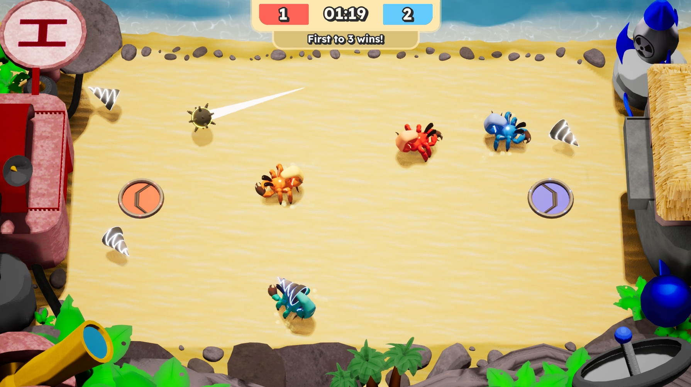
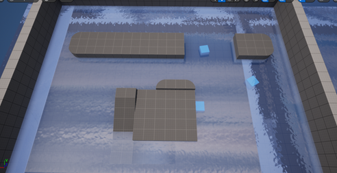
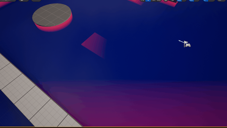
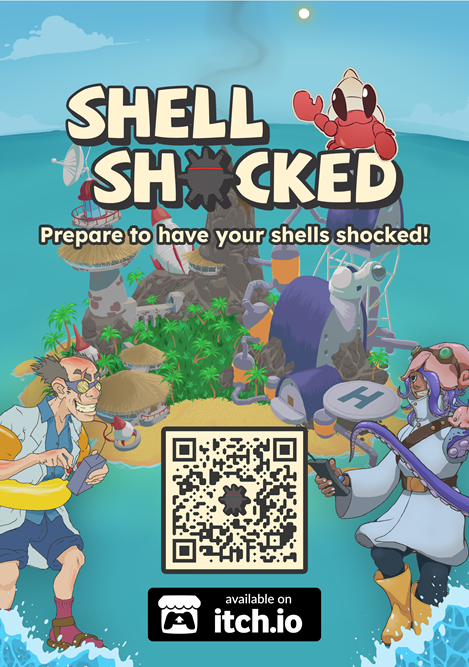

## 💎 General information

Shell Shocked is a 2v2 couch coop game where you play as a mechanized hermit crab trying to get a mine into the opposing team's goal. Stun crabs, shoot shells, and hit the ball to try and get the highest score for your team and win in the chaos!

The game was developed as an 8-week group project during my first year at university, with a team of 14 people.

> More information on the [Itch.io page](https://robbinverwijs.itch.io/shellshocked).

## 💫 My contributions

My primary contribution was researching water shaders using the UE5 water plugin. Although I gained valuable insights through experimentation, various constraints prevented us from implementing the shader in the final game.

I also implemented gameplay features such as slow motion and freeze frames for goal scoring and endgame moments, as well as haptic feedback for player actions like being stunned or picking up the shell.

In addition, I dedicated significant time to bug fixing to ensure the game was as polished and presentable as possible.

