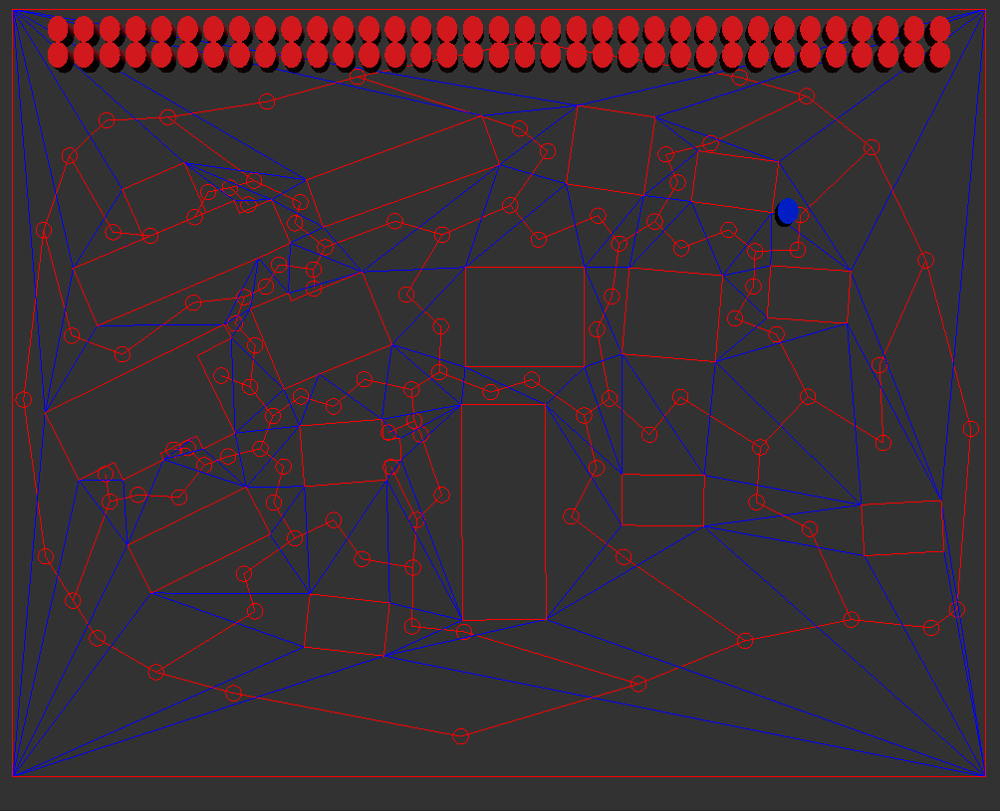
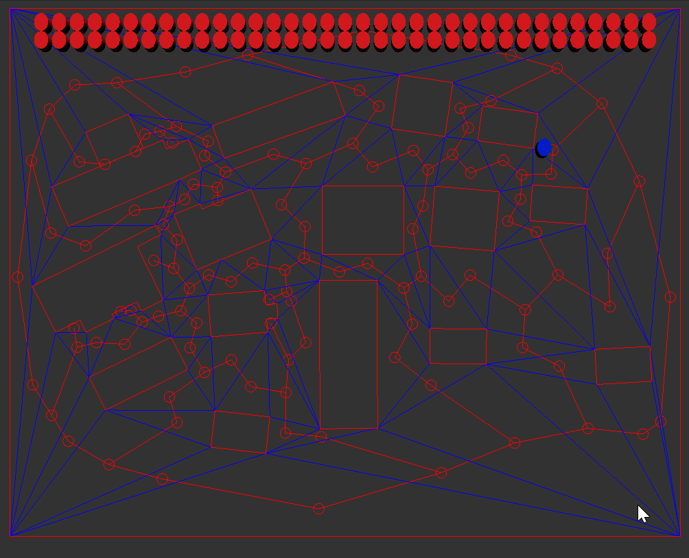
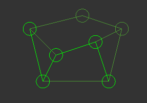
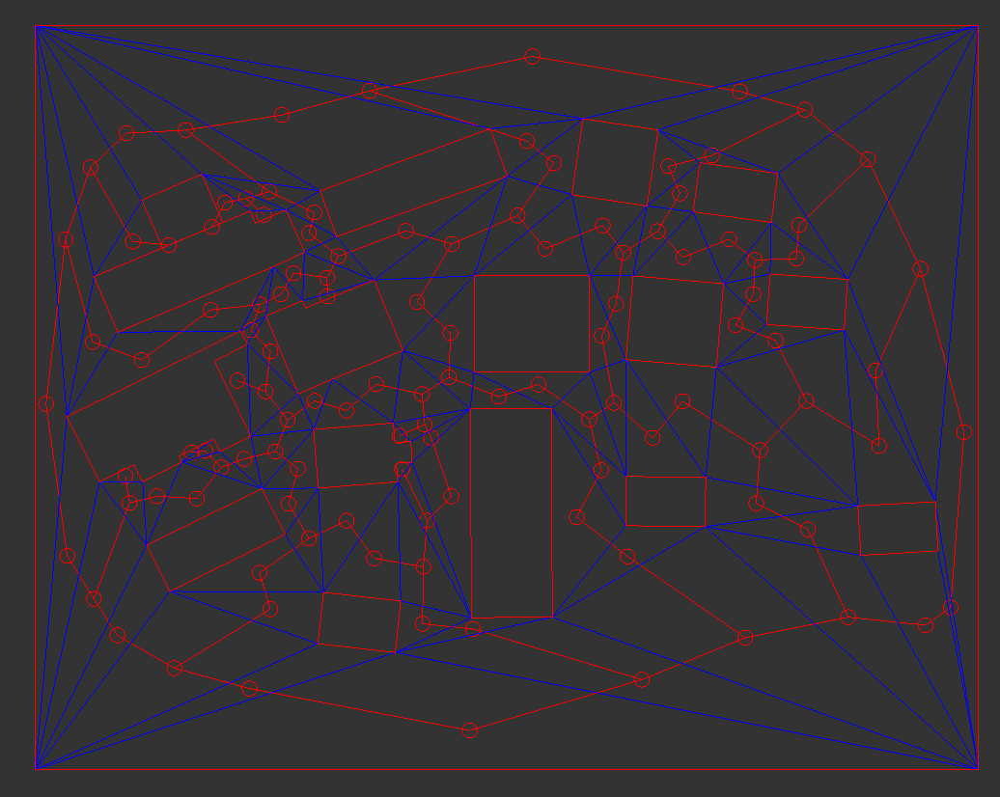

## 🎓 Development Notes
This was the first project I worked on in my second year of university, built using a provided template without relying on any external engines. The project demonstrates the integration of AI pathfinding with physics simulation, allowing agents to navigate a mesh toward the player's position while responding to gravity and collision forces. The code can be run in three different modes: with gravity applied to the agents, with the ability for the player to push them around, or with standard pathfinding behavior.

- apply gravity to the agents 

  

- push the agents around  

  

- classic path following  

  

## 🎮 Project Overview
AI&Physics is a 2D simulation system that combines A* pathfinding with custom physics integration. Agents navigate through a procedurally loaded navigation mesh while responding to physics forces, demonstrating the interplay between AI navigation and rigid body dynamics.

**Tech Stack:** C++, CDT (Constrained Delaunay Triangulation), Clipper2 library, custom template

**Key Features:**

- A* pathfinding with priority queue optimization
- Custom physics engine with rigid body dynamics
- Collision detection and resolution (disk-to-disk and disk-to-polygon)
- Navigation mesh generation from file input
- Three gameplay modes: gravity, pushing, and pathfinding
- ECS (Entity Component System) architecture

## 🔧 Technical Implementation
### A* Pathfinding with Priority Queue
I implemented the A* search algorithm using a priority queue to find the shortest path between two vertices. The algorithm efficiently explores nodes based on their estimated total cost, prioritizing nodes with the lowest estimated total cost first. This ensures the most promising path is explored and significantly speeds up the search process.

```cpp
std::priority_queue<PathNode> open_set;
open_set.emplace(start_id, 0.0f, h_cost);

while (!open_set.empty())
{
    // Get the node with the lowest estimated total cost from the open set
    PathNode current = open_set.top();
    open_set.pop();
}
```


## Navigation Mesh Generation
The navigation mesh is loaded from a file using a custom parser with tokenization. I created a vector of strings containing each item from the file, separated by spaces. The parser checks if the first token is 'w' (walkable area) or 'o' (obstacle), then iterates through the line starting from the second item, adding pairs of numbers into a PointD variable representing x and y coordinates.

I also created a CleanupGeometry() function that uses the difference function from the Clipper library to subtract obstacles from the walkable area. For triangulation, I used the CDT library to insert all vertices and edges. Obstacles are drawn by iterating through all paths using the finalPath variable created in CleanupGeometry().


```cpp
NavigationMesh::NavigationMesh(const std::string& filename)
{
    std::ifstream mapFile(filename);
    if (mapFile.is_open())
    {
        std::string item;
        std::string line;

        while (getline(mapFile, line))
        {
            std::stringstream str_strm;
            str_strm << line;
            std::vector<std::string> tokens;
            PathD polygonW;
            PathD polygonO;
            while (getline(str_strm, item, ' '))
            {
                tokens.push_back(item);
            }
            if (tokens[0] == "w")
            {
                for (int i = 1; i < tokens.size(); i++)
                {
                    if (i + 1 < tokens.size())
                    {
                        PointD point(stod(tokens[i]), stod(tokens[i + 1]));
                        polygonW.push_back(point);
                        i++;
                    }
                }
                walkablearea.push_back(polygonW);
            }
            if (tokens[0] == "o")
            {
                for (int i = 1; i < tokens.size(); i++)
                {
                    if (i + 1 < tokens.size())
                    {
                        PointD point(stod(tokens[i]), stod(tokens[i + 1]));
                        polygonO.push_back(point);
                        i++;
                    }
                }
                obstacles.push_back(polygonO);
            }
             mapFile.close()
        }
    }
```



### Entity Creation with ECS
Agents are created using an Entity Component System architecture, with components for Transform, NavMeshAgent, rendering, RigidBody, and collision:

```cpp
for (auto agents : navigationSystem.GetNavigationMesh().GetAIPosition())
{
    {  // Create the agents
        auto entity = Engine.ECS().CreateEntity();

        auto& transform = Engine.ECS().CreateComponent<Transform>(entity);
        transform.Translation = vec3(agents.x, agents.y, 0);
        transform.Scale = vec3(0.4, 0.5, 0.2);
        Engine.ECS().CreateComponent<NavMeshAgent>(entity);
        auto& mesh_renderer = Engine.ECS().CreateComponent<SimpleMeshRender>(entity);
        mesh_renderer.mesh = Engine.Resources().Load<SimpleMesh>("meshes/cylinder.obj");
        mesh_renderer.texture = Engine.Resources().Load<SimpleTexture>("textures/red.png");
        auto rigidbody = Engine.ECS().CreateComponent<RigidBody>(entity, 1.0f, glm::vec2(transform.Translation.x, transform.Translation.y));
        auto diskCollider = Engine.ECS().CreateComponent<DiskCollider>(entity, 0.5f);
    }
}
```

## ⚙️ Physics System Implementation

### Custom Physics Engine
I created a custom physics system with a RigidBody class added as a component to agents and the player. In the physics loop, the system:

1. Iterates through all agents and accumulates total forces
2. Updates position and velocity using force and inverse mass
3. Clears forces
4. Updates entity transforms

The navigation system was modified to set the linear velocity of rigid bodies directly, allowing seamless integration between AI and physics.

### Collision Detection & Resolution
I implemented a DiskCollider class with radius getter methods and created collision detection for both disk-to-disk and disk-to-polygon scenarios.

### Impulse-Based Collision Resolution:

```cpp
void PhysicsSystem::ImpulseResolveCollision(RigidBody& a, RigidBody& b, const CollisionData& p)
{
    float total_mass = a.GetInverseMass() + b.GetInverseMass();

    a.SetPosition(a.GetPosition() + p.normal * p.depth * (a.GetInverseMass() / total_mass));
    b.SetPosition(b.GetPosition() - p.normal * p.depth * (b.GetInverseMass() / total_mass));

    glm::vec2 relativeVeocity = a.GetVelocity() - b.GetVelocity();

    float cRestitution = 0.66f;
    float dotproduct = glm::dot(relativeVeocity, p.normal);
    if (dotproduct <= 0)
    {
        float j = -(1 + cRestitution) * (dotproduct / total_mass);

        a.SetVelocity(a.GetVelocity() + a.GetInverseMass() * j * p.normal);
        b.SetVelocity(b.GetVelocity() - b.GetInverseMass() * j * p.normal);
    }
}
```

The CollisionData struct stores the collision normal and penetration depth. The modified disk-to-disk collision detection returns these variables, which are then used in the physics loop:
```cpp
auto data = DiskDiskCollision(body1.position, body2.position, diskCollider1.GetRadius(), diskCollider2.GetRadius());
if (data.depth > 0)
{
    ImpulseResolveCollision(body1, body2, data);
}
```
### Polygon Collision Handling
For polygon collision detection, I created a conversion function that transforms PathsD types into geometry2d::Polygon types:

```cpp
const geometry2d::PolygonList NavigationMesh::MakePathsDIntoPolygons(PathsD pathsd) const
{
   geometry2d::PolygonList polygonList;
   for (int i = 0; i < pathsd.size(); i++)
   {
       geometry2d::Polygon polygon;
       for (int j = 0; j < pathsd[i].size(); j++)
       {
           polygon.push_back(glm::vec2(pathsd[i][j].x, pathsd[i][j].y));
       }
           polygonList.push_back(polygon);
   }
   return polygonList;
}
```

All obstacles are instantiated in the game class by creating a PolygonCollider component. In the physics system, the code iterates through all rigid bodies and polygons to resolve collisions appropriately.