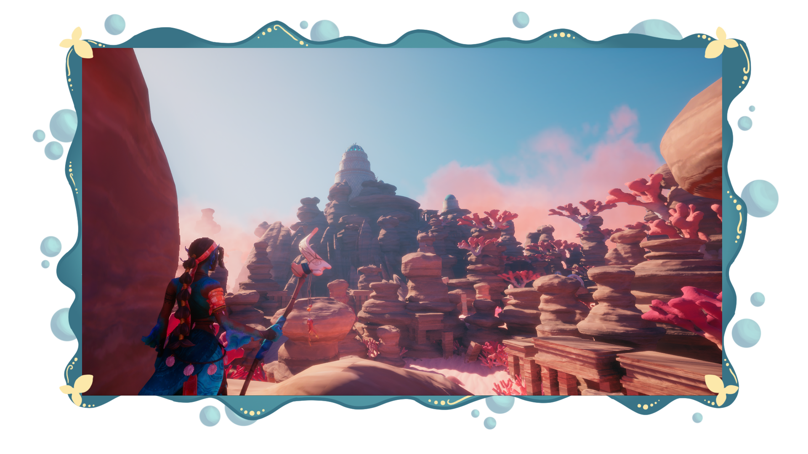
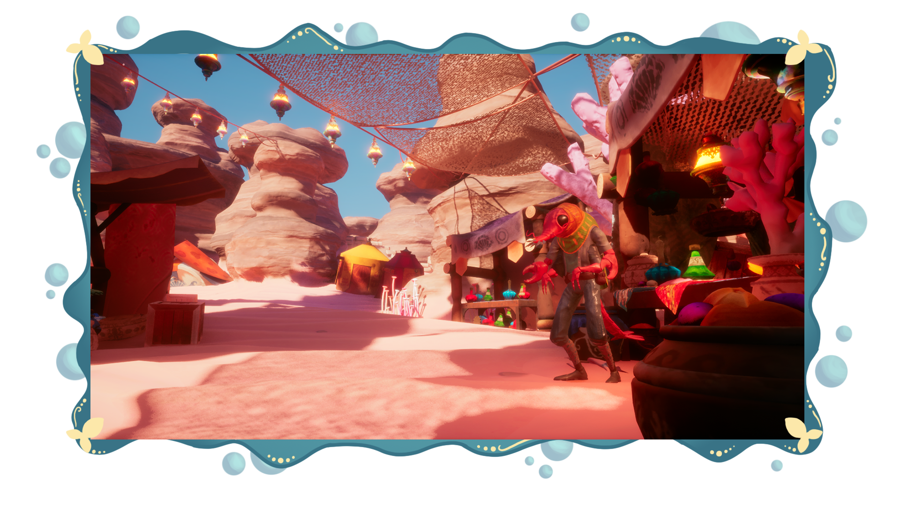
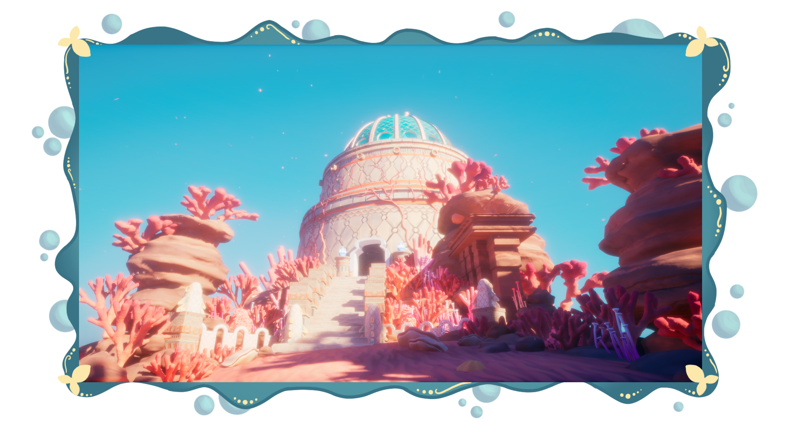
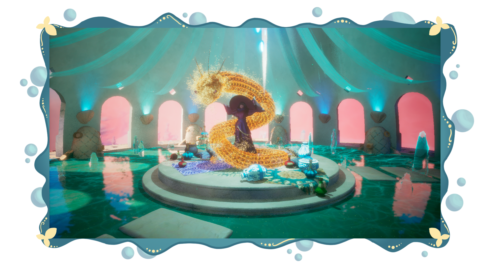
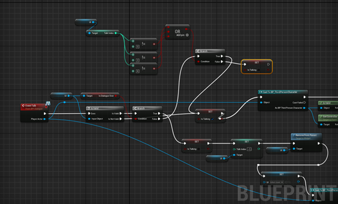

## 💎 General information

Dive into the world of Marisol and retrieve the magical crystal to save the local people. During your adventure, enemies will try to hold you back, and there will be puzzles that require solving.

## ⭐ Trailer



Marisol was developed as an 8-week-long student project. The team was made up of 23 second-year students from Breda University of Applied Sciences.

> More information on the [Itch.io page](https://buas.itch.io/marisol).

## 💫 My contribution

### ⚪ Camera
As part of the 3C’s strike team, I worked on refining the camera to make it feel natural and responsive for the player. I implemented smooth transitions between an over-the-shoulder view and a distant view, while ensuring the camera would not clip through walls or other objects in the scene. Additionally, I added a trigger system that briefly locks the camera onto a specific object, slowing the player and preventing manual camera control during the focus. To improve usability, I limited the camera pitch so it cannot tilt too far up or down, and I adjusted the camera arm length dynamically—extending when looking up and shortening when looking down.

<video width="320" height="240" controls>
  <source src="/assets/marisol/marisolvideo.mp4" type="video/mp4" alt="Camera">
</video>

### ⚪ Shield

I also worked on the main character's shield implementation. It can be set active by pressing a button, makes you unable to move while active and protects you from taking damage. I also made the ground ripple projectile deal damage to the player since that wasn't already implemented.

<video width="320" height="240" controls>
  <source src="/assets/marisol/marisolshield.mp4" type="video/mp4" alt="Shield">
</video>

### ⚪ Respawn system

Once the player dies, it teleports to the player start location after a delay of 2 seconds. I manually set the current health back to max health and also update the health widget. So that the change doesn't feel too sudden, I made the screen fade out to black. After it dies, the player has its movement and camera restricted until it teleports.

<video width="320" height="240" controls>
  <source src="/assets/marisol/marisolrespawn.mp4" type="video/mp4" alt="Respawn">
</video>

### ⚪ Dialogue system

For the dialogue system I first created a data table where I added all the necessary text for the dialogue. However, when I added the font given by one of the artists, the punctuation marks couldn't be seen properly so we worked together in finding a solution for it because we really didn't want to use the default font. 

Based on each talk index, I set the correct images for the speech and name.
I also worked on making the talk animation of the NPC only run when the correct line of dialogue is on screen, but couldn't manage to.

<video width="320" height="240" controls>
  <source src="/assets/marisol/marisoldialogue.mp4" type="video/mp4" alt="Dialogue">
</video>

### ⚪ Bug fixing

To ensure the best possible experience, I dedicated time to testing and fixing bugs in the game, as well as thoroughly checking the map for areas where the player could fall through or get stuck.
