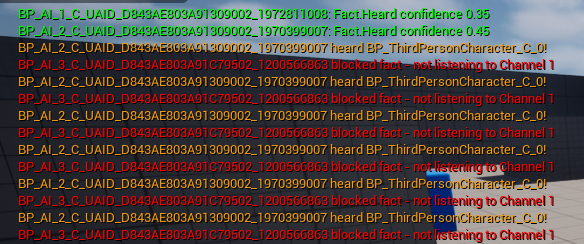
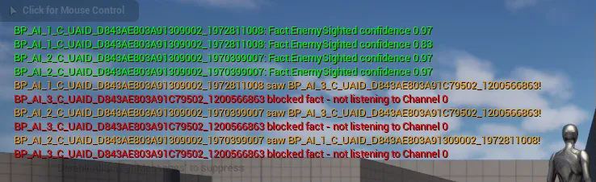
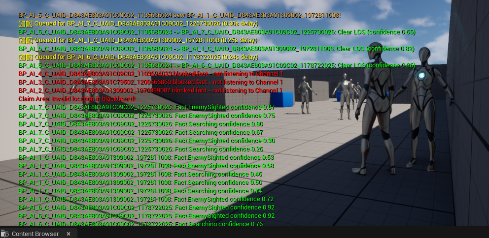
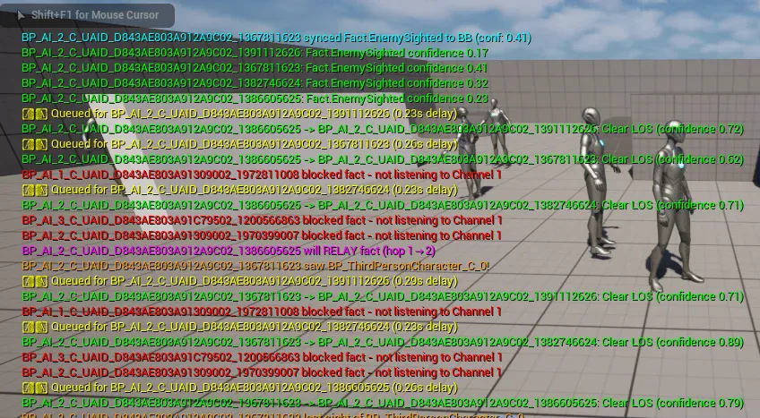
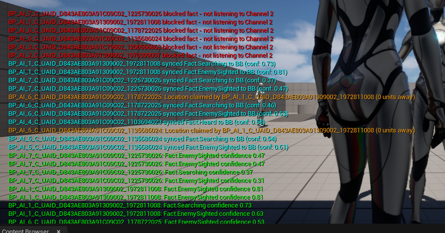
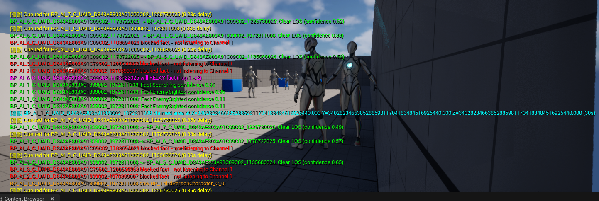

## 💎 General information

AI Team Communication is a plugin I built from scratch in Unreal Engine 5 using C++. It enables AI agents to share tactical information with each other through a fact-based communication system. When an AI sees or hears the player, it broadcasts this information as a "fact" to nearby teammates.

Each fact has a confidence value that represents how reliable or current that information is. When an AI first observes something directly (like spotting the player), the fact starts with high confidence. As time passes without confirmation, this confidence gradually decays toward zero, simulating how information becomes stale and less trustworthy. This means AI agents will prioritize fresh intelligence from teammates who recently saw the player over older reports, creating more realistic and dynamic tactical behavior.

## AI hearing detection for player movement using listening channels


The yellow lines show that AI_2 heard the player. The fact is being broadcasted to AI_1, but not to AI_3 because it is not listening to channel 1. There is no message of the AI seeing the player, which means that AIs detect sound even when the player is not visible.

## AI sight detection for player tracking using listening channels


AI_2 sees AI_1 and broadcasts to it. AI_3 is blocking that fact because it listens to a different channel.

## Channel-based communication routing
The variable for listening channels is an array `TArray<int32> ListeningChannels = { 0 };` which allows the AI to subscribe to multiple channels simultaneously. Facts are broadcasted to AIs listening on the same channel and blocked to others.

## Realistic communication latency system

Based on the yellow message, we can see that the facts for AI_6 and AI_7 are queued with some delay.

### 1. Before broadcasting, facts are added to queue `PendingDeliveries.Add(Delivery);`. 

### 2. Facts delivered when time arrives
```cpp
if (CurrentTime >= Delivery.DeliveryTime)
        {
            DeliverFactToReceiver(Delivery);
            PendingDeliveries.RemoveAt(i);
        }
```

### 3. Closer receivers get facts faster
```cpp
float LatencySeconds = Distance / CommunicationSpeed;
float MinLatency = 0.1f;
float MaxLatency = 3.0f;
LatencySeconds = FMath::Clamp(LatencySeconds, MinLatency, MaxLatency);
return GetWorld()->GetTimeSeconds() + LatencySeconds;
```

### 4. System doesn't crash when receivers are destroyed before delivery 

I am using a weak pointer for the receiver `TWeakObjectPtr Receiver;`

## MaxHops and role-based rebroadcasting for controlled information relay
### 1. Create an enumerator that categorizes AI behavior types

```UENUM(BlueprintType)
enum class EAIRole : uint8
{
    Scout       UMETA(DisplayName = "Scout - Relays information"),
    Guard       UMETA(DisplayName = "Guard - Does not relay"),
    Commander   UMETA(DisplayName = "Commander - Always relays"),
    Support     UMETA(DisplayName = "Support - Selective relay")
};
```
### 2. Rebroadcast permission on components

Each AI has attached to them a boolean which decides if they rebroadcast facts:
```cpp
if (Receiver->bCanRebroadcast && Fact.CanRelay())
{
    bShouldRebroadcast = true;
}
Receiver->AddOrUpdateFact(Fact, bShouldRebroadcast);
```

### 3. Current hops is incremented when fact copied for receiver
```cpp
 if (bListeningToChannel && bInRange)
 {
     FSharedFact Copy = Fact;
     Copy.CurrentHops ++ ;
 }
```

### 4. Early exit when hop limit reached
```cpp
if (!Fact.CanRelay())
return;
```

 

The purple text shows max hops working.

## Area claims system for coordinated search

[alt text](../assets/AITeamCommunication/claimarea3.png) 

 

The AI claim areas without overlapping.

<video width="320" height="240" controls>
  <source src="../assets/AITeamCommunication/claimarea.mp4" type="video/mp4" alt = "claimarea">
</video>
