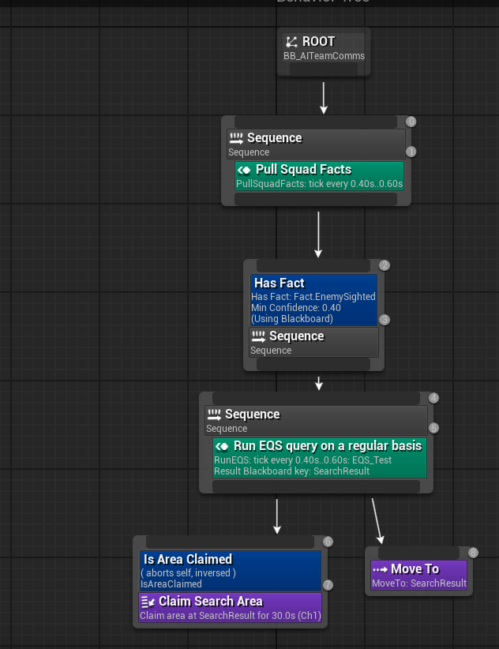

## 🎓 Development Notes
AI Team Communication is a plugin I built from scratch in Unreal Engine 5 using C++. This project demonstrates advanced AI programming concepts including fact-based knowledge systems, confidence decay algorithms, multi-channel communication routing, and coordinated team behavior. The plugin enables AI agents to share tactical information with realistic constraints such as communication latency, limited relay range, and role-based rebroadcasting permissions, creating more believable and dynamic AI teamwork.

## 🎮 Project Overview
The AI Team Communication plugin enables AI agents to share tactical information with each other through a fact-based communication system. When an AI sees or hears the player, it broadcasts this information as a "fact" to nearby teammates, creating coordinated responses and realistic tactical behavior.

**Tech Stack:** Unreal Engine 5, C++
### Key Features:

- Fact-based knowledge sharing with confidence decay
- Multi-channel communication routing
- Distance-based communication latency
- Role-based rebroadcasting with hop limits
- Area claim system for coordinated search
- Line-of-sight and audio detection integration
- Weak pointer safety for destroyed receivers

## 💫 Core Systems
### Confidence Decay System
Each fact has a confidence value that represents how reliable or current that information is. When an AI first observes something directly (like spotting the player), the fact starts with high confidence. As time passes without confirmation, this confidence gradually decays toward zero, simulating how information becomes stale and less trustworthy. This means AI agents will prioritize fresh intelligence from teammates who recently saw the player over older reports, creating more realistic and dynamic tactical behavior.

### Detection Systems
### AI Hearing Detection for Player Movement


The yellow lines show that AI_2 heard the player. The fact is being broadcasted to AI_1, but not to AI_3 because it is not listening to channel 1. There is no message of the AI seeing the player, which means that AIs detect sound even when the player is not visible.

### AI Sight Detection for Player Tracking


AI_2 sees AI_1 and broadcasts to it. AI_3 is blocking that fact because it listens to a different channel.

## 🔧 Technical Implementation
### Channel-Based Communication Routing
The variable for listening channels is an array ``TArray<int32> ListeningChannels = { 0 };`` which allows AI agents to subscribe to multiple channels simultaneously. Facts are broadcasted to AIs listening on the same channel and blocked from those on different channels. This enables squad-based communication where different teams can operate independently without information leakage.

### Realistic Communication Latency System


Based on the yellow message, we can see that the facts for AI_6 and AI_7 are queued with some delay.

### Implementation Steps:
1. Before broadcasting, facts are added to queue
```cpp
PendingDeliveries.Add(Delivery);
```
2. Facts delivered when time arrives
```cpp
if (CurrentTime >= Delivery.DeliveryTime)
        {
            DeliverFactToReceiver(Delivery);
            PendingDeliveries.RemoveAt(i);
        }
```
3. Closer receivers get facts faster
```cpp
float LatencySeconds = Distance / CommunicationSpeed;
float MinLatency = 0.1f;
float MaxLatency = 3.0f;
LatencySeconds = FMath::Clamp(LatencySeconds, MinLatency, MaxLatency);
return GetWorld()->GetTimeSeconds() + LatencySeconds;
```
4. System doesn't crash when receivers are destroyed before delivery

I am using a weak pointer for the receiver ``TWeakObjectPtr<UAITeamCommComponent> Receiver;`` which automatically handles cases where AI agents are destroyed before queued facts can be delivered, preventing null pointer crashes.

## ⚙️ Advanced Features
### MaxHops and Role-Based Rebroadcasting
This system controls how information propagates through the team, preventing infinite relay loops and creating strategic communication patterns.
1. **AI Role Enumerator**

Created an enumerator that categorizes AI behavior types:
```UENUM(BlueprintType)
enum class EAIRole : uint8
{
    Scout       UMETA(DisplayName = "Scout - Relays information"),
    Guard       UMETA(DisplayName = "Guard - Does not relay"),
    Commander   UMETA(DisplayName = "Commander - Always relays"),
    Support     UMETA(DisplayName = "Support - Selective relay")
};
```
2. **Rebroadcast Permission on Components**

Each AI has a boolean attached that decides if they rebroadcast facts:
```cpp
if (Receiver->bCanRebroadcast && Fact.CanRelay())
{
    bShouldRebroadcast = true;
}
Receiver->AddOrUpdateFact(Fact, bShouldRebroadcast);
```

3. **Current Hops Incremented When Fact Copied for Receiver**
```cpp
 if (bListeningToChannel && bInRange)
 {
     FSharedFact Copy = Fact;
     Copy.CurrentHops ++ ;
 }
```

4. **Early Exit When Hop Limit Reached**
```cpp
if (!Fact.CanRelay())
return;
```

 

The purple text shows max hops working, demonstrating how facts stop propagating after reaching their relay limit.

## 🗺️ Area Claims System
### Coordinated Search Behavior
The area claims system prevents AI agents from overlapping during search operations, ensuring efficient coverage of the environment.

 

 

The AI claim areas without overlapping, demonstrating intelligent spatial coordination.

<video width="320" height="240" controls>
  <source src="/assets/AITeamCommunication/claimarea.mp4" type="video/mp4" alt ="Claimarea">
</video>

This system allows AI teams to systematically search environments without wasting effort on redundant coverage, creating more intelligent and coordinated behavior.

## 🎯 Key Achievements

- Built a complete AI communication plugin from scratch in C++ for Unreal Engine 5
- Implemented confidence decay system simulating realistic information degradation
- Created distance-based communication latency for authentic tactical delays
- Designed role-based rebroadcasting with hop limits to control information propagation
- Developed area claims system enabling coordinated search without overlap
- Implemented robust weak pointer handling preventing crashes from destroyed agents
- Integrated multi-channel communication routing for squad-based operations
- Combined sight and hearing detection for comprehensive player awareness