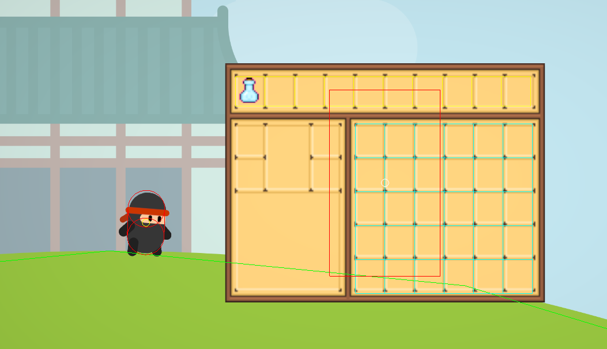
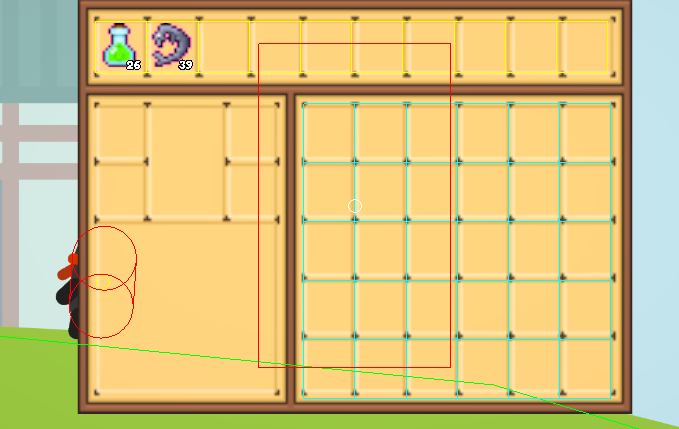
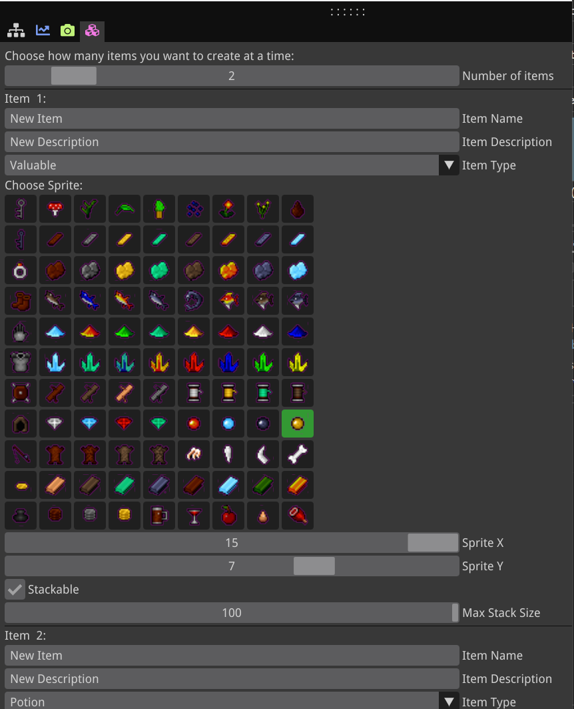

## 🎓 Development Notes
This inventory system was built entirely from scratch in C++ using a custom engine template from university, with SDL2 for rendering and ImGui for the item creation tool. The project demonstrates low-level game systems programming, including UI coordinate transformations, entity lifecycle management in an ECS architecture, and performance optimization through caching. Rather than relying on engine features like Unity or Unreal provide, I implemented every aspect myself—from pixel-perfect slot positioning to multi-digit quantity displays using individual sprite entities.

## 🎮 Project Overview
An inventory system combining features from games like Minecraft, 7 Days to Die, and Dying Light. The system supports stackable items, drag-and-drop manipulation, context menus, and complete save/load functionality—all built without relying on external game engine UI systems.

**Tech Stack:** C++, SDL2, OpenGL, ImGui, nlohmann/json, Custom ECS

**Key Features:**

- Custom item creation tool for designers (no code required)
- Drag-and-drop with left-click (move all) and right-click (split stack) support
- Multi-digit quantity displays using individual sprite entities
- Item popup system (Use/Equip/Drop functionality)
- Full JSON serialization for save/load
- Grid-based layout (10x4 = 40 slots)
- Stackable items with configurable max stack sizes
- Pixel-perfect slot positioning with coordinate transformation

## 💫 System Architecture

### ECS Approach
The system uses an Entity Component System architecture where items aren't just data structures—they're actual entities in the world. This provides several benefits:

**Items as Entities:**

- Each item is an entity with Transform, Sprite, and ItemData components
- When dropped, items already exist in the world (no conversion needed)
- Picking up items simply moves entities from world to inventory
- Consistent behavior whether items are held or dropped

### State Management:
Items exist in different states:

- **In the world** - Normal entity with physics and collision
- **In inventory** - Visual only, no physics
- **Being dragged** - Following mouse, semi-transparent

This is managed through a simple state machine with component enable/disable logic.

### Core Data Structures

**Inventory Class:**

```cpp
class Inventory {
private:
    std::vector<Slot> m_slots;
    bool m_isVisible = false;
    int m_capacity;
    
public:
    bool AddItem(Entity* item);
    bool RemoveItem(int slotIndex);
    void ToggleUI();
    void Update(float deltaTime);
    void MoveItem(int sourceSlot, int destSlot);
};
```

**Slot Class:**
```cpp
class Slot {
private:
    Item* m_item;
    int m_quantity;
public:
    bool IsEmpty() const { return m_item == nullptr; }
    bool AddQuantity(int amount);
    bool RemoveQuantity(int amount);
    void Clear();
};
```

**Item Class:**
```cpp
class Item {
private:
    std::string m_name;
    std::string m_description; 
    std::string m_texturePath;
    ItemType m_type;
    bool m_stackable;
    int m_maxStackSize;
    int m_spriteX;
    int m_spriteY;
}
```
## 🔧 UI Implementation
### Positioning the Inventory Slots
One of the most challenging aspects was positioning 40 invisible slot entities to perfectly align with the inventory texture.

### Layout Math:
The inventory texture is 200x150 pixels, displayed as a 6.5 x 4.875 world-space quad with:

- 10 slots in the top row (hotbar)
- 6 columns × 5 rows on the right side (storage grid)

### Hotbar Positioning (Slots 0-9):
```cpp
const int numVisibleSlots = 10;
float slotSize = invWidth / 10.f; // = 0.65

float firstSlotCenterX = -invWidth / 2.0f + slotSize / 2.0f;
float topRowCenterY = invHeight / 2.0f - slotSize / 2.0f;

for (int i = 0; i < numVisibleSlots; i++)
{
    float iconScale = slotSize * 0.8f;
    float offsetX = slotSize * 0.25f;
    float offsetY = -slotSize * 0.35f;

    float x = firstSlotCenterX + ((slotSize - 0.04f) * i) + offsetX;
    float y = topRowCenterY + offsetY;

    iconTransform.SetTranslation(vec3(x, y, 26.f)); // Z=26 renders above inventory
    iconTransform.SetScale(vec3(iconScale));
}
```

### Storage Grid Positioning (Slots 10-39):
```cpp
const int rightGridStartIdx = 10;
const int rightGridRows = 5;
const int rightGridCols = 6;

float rightSlotSizeY = slotSize * 1.15f; // Taller slots for grid
float rightGridStartX = firstSlotCenterX + ((slotSize - 0.05f) * 4) + 0.05f;
float rightGridStartY = topRowCenterY - (slotSize * 2) + 0.25f;

for (int i = rightGridStartIdx; i < rightGridStartIdx + (rightGridRows * rightGridCols); i++)
{
    int gridIdx = i - rightGridStartIdx;
    int row = gridIdx / rightGridCols;
    int col = gridIdx % rightGridCols;

    float x = rightGridStartX + ((slotSize - 0.05f) * col) + offsetX;
    float y = rightGridStartY - ((rightSlotSizeY - 0.05f) * row) + offsetY;

    iconTransform.SetTranslation(vec3(x, y, 26.f));
}
```


*Debug visualization showing slot boundaries for alignment*
### Multi-Digit Quantity Display
Instead of rendering text dynamically (expensive), the system uses individual digit sprites (0-9) combined to show any number.
### The Approach:
Convert quantity to string, process each character, load corresponding digit sprite, and position side-by-side:
```cpp
std::string qtyStr = std::to_string(qty);  // e.g., 42 becomes "42"
int numDigits = static_cast<int>(qtyStr.length());

float digitSpacing = digitScale * 0.3f;
float totalWidth = (numDigits - 1) * digitSpacing;

float startX = slotPos.x + (iconScale * 0.4f) - totalWidth;
float startY = slotPos.y - (iconScale * 0.5f) + (digitScale * 0.5f) - 0.1f;

for (int d = 0; d < numDigits; d++)
{
    char digitChar = qtyStr[d];
    int digitValue = digitChar - '0';  // '4' -> 4, '2' -> 2
    
    auto digitEntity = ecs.CreateEntity();
    float digitX = startX + (d * digitSpacing);
    
    std::string digitTexture = "textures/digit-" + std::to_string(digitValue) + ".png";
    // Create and position individual digit sprite
}
```


## 💫 Item Management
### Item Creation Tool
Built a visual editor using ImGui allowing designers to create items without code. Features include:

- Input fields for name, description, type, and stacking behavior
- Visual sprite sheet selection with clickable boxes
- Pre-configured sprite regions per item type
```cpp
void ItemCreation::GetSpriteRangeForType(ItemType type, int& minX, int& maxX, int& minY, int& maxY)
{
    switch (type)
    {
    case ItemType::Potion:
        minX = 0; maxX = 6;
        minY = 0; maxY = 0;
        break;
    case ItemType::Armour:
        minX = 4; maxX = 7;
        minY = 3; maxY = 5;
        break;
    // ... other types
    }
}
```


### Stacking Logic
When adding items, the system intelligently handles stacking:
```cpp
if (item->IsStackable())
{
    // First pass: fill existing stacks
    for (int i = 0; i < m_slots.size(); i++)
    {
        Item* existingItem = m_slots[i].GetItem();
        
        if (existingItem && existingItem->IsSameItem(*item))
        {
            int spaceAvailable = existingItem->GetMaxStackSize() - m_slots[i].GetQuantity();
            
            if (spaceAvailable > 0)
            {
                int amountToAdd = std::min(spaceAvailable, quantity);
                m_slots[i].AddQuantity(amountToAdd);
                quantity -= amountToAdd;
                
                if (quantity == 0) return true;
            }
        }
    }
    
    // Second pass: create new stacks if items remain
    if (quantity > 0)
    {
        int emptySlot = FindEmptySlot();
        if (emptySlot == -1) return false;
        
        m_slots[emptySlot].SetItem(item);
        m_slots[emptySlot].SetQuantity(quantity);
    }
}

```
<video width="320" height="240" controls>
  <source src="/assets/inventorysystem/stacking.mp4" type="video/mp4" alt="Stacking">
</video>

## 🎭 Interaction Systems
### Hover Detection & Coordinate Transformation
Converting mouse position through multiple coordinate spaces to check slot collision:
```cpp
// Convert mouse from screen space to world space
float mouseWorldX = cameraTransform.GetTranslation().x + 
                    (mouseScreenPos.x / screenWidth - 0.5f) * worldWidth;
float mouseWorldY = cameraTransform.GetTranslation().y - 
                    (mouseScreenPos.y / screenHeight - 0.5f) * worldHeight;

// AABB collision check
float minX = slotCenterX - slotSize / 2.0f;
float maxX = slotCenterX + slotSize / 2.0f;
float minY = slotCenterY - slotSize / 2.0f;
float maxY = slotCenterY + slotSize / 2.0f;

if (mouseWorldX >= minX && mouseWorldX <= maxX &&
    mouseWorldY >= minY && mouseWorldY <= maxY)
{
    currentHoveredSlot = i;
    iconTransform.SetScale(vec3(iconScale * 1.1f)); // 10% larger when hovered
}
```

### Item Popup System
Popup displays item name/description using SDL_ttf for text rendering. Three action buttons (Use, Equip, Drop) are part of the popup sprite with invisible collision boxes for click detection.
```cpp
void UpdatePopupText(const std::string& itemName, const std::string& itemDescription)
{
    TTF_Font* font = TTF_OpenFont("assets/textures/font.ttf", 24);
    SDL_Color textColor = { 255, 255, 255, 255 };

    int nameWidth, nameHeight;
    auto nameImage = CreateTextImage(itemName, font, textColor, nameWidth, nameHeight);

    if (nameImage)
    {
        auto nameTexture = std::make_shared<Texture>(nameImage, nameSampler);
        auto nameMaterial = std::make_shared<Material>();
        nameMaterial->BaseColorTexture = nameTexture;
        
        auto& renderer = ecs.Registry.get<MeshRenderer>(m_popupItemName);
        renderer.Material = nameMaterial;
    }
}
```
<video width="320" height="240" controls>
  <source src="/assets/inventorysystem/hovering.mp4" type="video/mp4" alt="Hovering">
</video>

## ⚙️ Advanced Features
### Drag and Drop System
State machine tracking mouse button, drag distance threshold, and quantity to move:
**Left-click** - Drags entire stack

**Right-click** - Drags half (rounded up)

```cpp
// Detect potential drag start
if (!m_isDragging && (leftPressed || rightPressed))
{
    m_dragStartMousePos = glm::vec2(mouseWorldX, mouseWorldY);
    m_potentialDragSlot = currentHoveredSlot;
    m_potentialDragIsRightClick = rightPressed;
}

// Check distance threshold
float dragDistance = glm::length(currentMousePos - m_dragStartMousePos);
const float dragThreshold = 0.1f;

if (dragDistance > dragThreshold && m_potentialDragSlot >= 0)
{
    m_isDragging = true;
    
    if (m_isSplitDragging)
    {
        int totalQuantity = slot.GetQuantity();
        m_splitDragQuantity = (totalQuantity + 1) / 2; // Half, rounded up
    }
    
    CreateDragGhost(m_potentialDragSlot); // Semi-transparent entity follows mouse
}
```

### Drop Handling:
```cpp
if ((!leftButton && !rightButton) && m_isDragging)
{
    if (currentHoveredSlot != -1 && currentHoveredSlot != m_dragSourceSlot)
    {
        if (m_isSplitDragging)
            MoveSplitItems(m_dragSourceSlot, currentHoveredSlot, m_splitDragQuantity);
        else
            MoveItems(m_dragSourceSlot, currentHoveredSlot);
    }
    
    DestroyDragGhost();
    m_isDragging = false;
}
```

<video width="320" height="240" controls>
  <source src="/assets/inventorysystem/draganddrop.mp4" type="video/mp4" alt="DragAndDrop">
</video>

### Item Actions
**Use (Potions):**
```cpp
void UseItem(int slotIndex, Item* item)
{
    if (item->GetType() == ItemType::Potion)
    {
        int currentHealth = playerControl->GetHealth();
        int maxHealth = playerControl->GetMaxHealth();

        if (currentHealth < maxHealth)
        {
            int newHealth = std::min(currentHealth + 1, maxHealth);
            playerControl->SetHealth(newHealth);
            m_playerInventory->RemoveItem(slotIndex, 1);
        }
    }
}
```

**Drop:**
```cpp
void DropItem(int slotIndex, Item* item)
{
    glm::vec2 playerPos = playerBody->GetPosition();
    glm::vec2 dropPos = playerPos + glm::vec2(2.0f, 0.0f);

    auto entity = CreateObject(itemID, vec3(dropPos.x, dropPos.y, 1.0f), true, 0.4f);
    ecs.CreateComponent<ItemPickup>(entity, itemID);

    m_playerInventory->RemoveItem(slotIndex, 1);
}
```

**Equip:**
```cpp
void EquipItem(int slotIndex, Item* item)
{
    // Delete previously equipped item
    if (ecs.Registry.valid(m_equippedItem))
        ecs.DeleteEntity(m_equippedItem);

    glm::vec2 playerPos = playerBody->GetPosition();
    m_equippedItem = CreateObject(itemID, vec3(playerPos.x + 0.8f, playerPos.y, 1.0f), false, 0.0f);
}

// In Update - equipped item follows player
if (ecs.Registry.valid(m_equippedItem))
{
    glm::vec2 playerPos = playerBody->GetPosition();
    equippedTransform.SetTranslation(vec3(playerPos.x + 0.8f, playerPos.y, 1.0f));
}
```

<video width="320" height="240" controls>
  <source src="/assets/inventorysystem/buttons.mp4" type="video/mp4" alt="Buttons">
</video>

## 💾 Serialization System
### JSON Save/Load
Due to compilation conflicts between Windows headers (from OpenGL) and C++17's std::byte, serialization code was separated into dedicated files with forward declarations.

**Collecting Data:**
```cpp
LevelItemData ItemCreation::CollectItemData() const
{
    LevelItemData data;
    
    // Collect item definitions from database
    for (const auto& [itemID, item] : platformer.GetItemDataBase())
    {
        ItemDefinitionData def;
        def.itemID = itemID;
        def.name = item->GetName();
        def.description = item->GetDescription();
        def.spriteX = item->GetSpriteX();
        def.spriteY = item->GetSpriteY();
        data.definitions.push_back(def);
    }
    
    // Collect spawn positions
    for (const auto& [entity, pickup, transform] : 
         ecs.Registry.view<ItemPickup, Transform>().each())
    {
        ItemSpawnData spawn;
        spawn.itemID = pickup.m_itemName;
        spawn.position = glm::vec2(transform.GetTranslation());
        data.spawns.push_back(spawn);
    }
    
    return data;
}
```
<video width="320" height="240" controls>
  <source src="/assets/inventorysystem/saveandload.mp4" type="video/mp4" alt="SaveAndLoad">
</video>

## 🎯 Key Achievements

- Built complete inventory system from scratch without relying on engine UI features
- Implemented pixel-perfect slot positioning through complex coordinate transformations
- Solved performance challenges through caching and entity lifecycle management
- Created designer-friendly tools enabling item creation without code
- Designed intuitive drag-and-drop with split-stack functionality
- Developed multi-digit display system using individual sprite entities
- Implemented full serialization supporting save/load of entire item layouts
- Integrated seamlessly with ECS architecture for consistent item behavior


## 📚 References

- SDL2 Development Library - https://www.libsdl.org/
nlohmann JSON for Modern C++ - https://github.com/nlohmann/json
- Game Programming Patterns: Component - https://gameprogrammingpatterns.com/component.html
- OpenGL - https://www.opengl.org/
- SDL2 Drag and Drop Implementation - https://gigi.nullneuron.net/gigilabs/sdl2-drag-and-drop/
